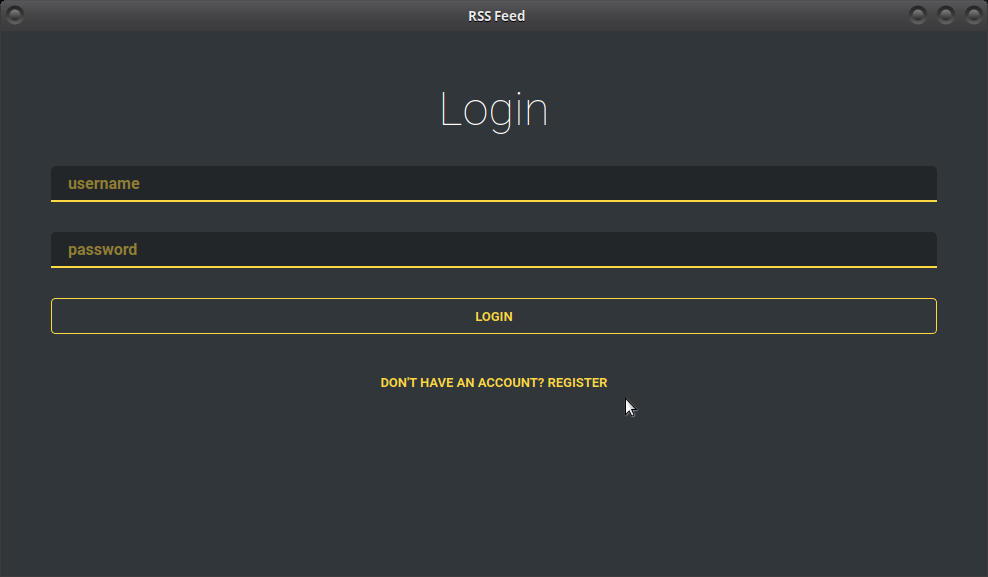
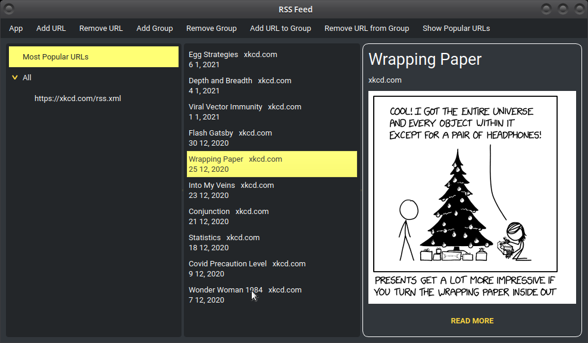

# RssFeed

This is a project made for our Software Engineering class.
The plan is to be a GUI driven RSS feed created using with the help of UML diagrams.

## Overview

The application is build using OOP practices, _Waterfall_ paradigm and with Test Driven Development.
We rely on PySide2 which is a Qt5 wrapper for python as our GUI and lmdb for handling the database.
Each account is created with some basic URL ready to go and each user can add more of them as they please.
Coding standard used to build this application is PEP-8.

## Demo

Login page looks as follow:

And the actual feed view:

